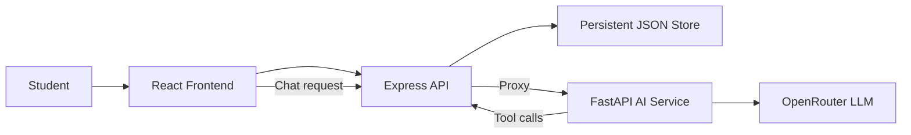

# CampusOS

**A student-focused campus data manager with a tool-enabled AI assistant.**

CampusOS brings class schedules, rooms, campus events, announcements, and assignment deadlines into one application. It combines a persistent data-management backend with an AI agent that reads and acts on the same live campus data.

Built for the **AUST CSE Carnival 8.0 — AI Build Hackathon**.

## Contents

- [Overview](#overview)
- [Features](#features)
- [Architecture](#architecture)
- [Technology Stack](#technology-stack)
- [Project Structure](#project-structure)
- [Prerequisites](#prerequisites)
- [Fresh Installation](#fresh-installation)
- [Updating an Existing Clone](#updating-an-existing-clone)
- [Running the Project](#running-the-project)
- [Health Checks](#health-checks)
- [API Reference](#api-reference)
- [AI Assistant](#ai-assistant)
- [Validation and Persistence](#validation-and-persistence)
- [Verification Commands](#verification-commands)
- [Troubleshooting](#troubleshooting)
- [Challenge Resources](#challenge-resources)

## Overview

CampusOS has two connected parts:

1. **Campus Data Manager** — a responsive interface for viewing and managing five campus information systems.
2. **CampusOS AI Assistant** — a tool-enabled agent that queries the current backend state and performs approved actions such as booking rooms and registering for events.

The frontend and AI agent never treat the original JSON files as live data. The files in `data/` are used only to seed the persistent backend on first run. All subsequent reads and writes go through the Express API.

## Features

### Campus data management

- Dashboard with live summaries and upcoming information
- Separate pages for schedules, rooms, events, announcements, and assignments
- Create, edit, and delete operations for all five resources
- Immediate UI updates after successful changes
- Persistent data across page reloads and server restarts
- Responsive student-focused interface

### Room management

- View room capacity, type, equipment, floor, and status
- Book an available room for a specific date and time
- Prevent overlapping bookings
- Cancel an existing booking
- Block booking attempts for unavailable rooms

### Event management

- View event schedules, venues, organizers, capacity, and status
- Register a student for an upcoming event
- Prevent duplicate registrations
- Enforce event capacity and registration status
- Cancel an existing registration
- Resolve meaningful partial event names through the AI assistant

### AI assistant

- Uses real function/tool calling through LangGraph and LangChain
- Reads the latest schedules, rooms, events, announcements, and assignments
- Answers date- and time-aware campus questions
- Finds rooms by capacity, equipment, date, and time
- Books and cancels room reservations
- Registers and cancels event registrations
- Maintains recent conversation context
- Refuses unsupported or unauthorized administrative actions
- Requests missing details when an action is unclear

## Architecture



The React frontend and Python AI service both communicate with the same Express API. A change made through the interface becomes immediately available to the AI agent.

## Technology Stack

| Layer | Technology |
|---|---|
| Frontend | React, React Router, Vite, Vanilla CSS |
| Backend API | Node.js, Express |
| Persistent storage | Server-managed JSON store seeded from the official dataset |
| AI service | Python, FastAPI, LangGraph, LangChain |
| LLM provider | OpenRouter |

No external database server is required.

## Project Structure

```text
.
├── backend/
│   ├── agent/                 # FastAPI and LangGraph AI service
│   ├── database/              # Persistent store implementation
│   ├── routes/                # Express API routes
│   ├── package.json
│   └── server.js
├── data/                      # Official seed JSON files
├── frontend/
│   ├── public/
│   ├── src/
│   │   ├── components/
│   │   ├── hooks/
│   │   ├── pages/
│   │   └── services/
│   └── package.json
├── sample_queries/            # Official judging queries
├── schema/                    # Official data schema
├── .env.example
├── PROBLEM_STATEMENT.md
├── SUBMISSION.md
└── README.md
```

## Prerequisites

Install the following before running CampusOS:

- **Git**
- **Node.js 18 or newer**
- **Python 3.10 or newer**
- **OpenRouter API key**
- An OpenRouter model that supports tool/function calling

## Fresh Installation

### 1. Clone the repository

```bash
git clone https://github.com/0xAhnaf/cse-carnival-8-aibuild-hackathon.git
cd cse-carnival-8-aibuild-hackathon
git switch main
```

### 2. Install backend dependencies

```bash
cd backend
npm install
cd ..
```

### 3. Install frontend dependencies

```bash
cd frontend
npm install
cd ..
```

### 4. Create the Python environment

```bash
cd backend/agent
python -m venv .venv
```

Windows PowerShell:

```powershell
& ".\.venv\Scripts\python.exe" -m pip install --upgrade pip
& ".\.venv\Scripts\python.exe" -m pip install -r requirements.txt
```

macOS/Linux:

```bash
./.venv/bin/python -m pip install --upgrade pip
./.venv/bin/python -m pip install -r requirements.txt
```

Return to the repository root:

```bash
cd ../..
```

### 5. Configure the AI service

Create `backend/agent/.env`:

```env
OPENROUTER_API_KEY=your_openrouter_api_key
OPENROUTER_MODEL=inclusionai/ling-3.0-flash-fin:free
BACKEND_API_URL=http://localhost:3000/api
AGENT_PORT=8001
```

Replace `your_openrouter_api_key` with a valid key. Never commit the `.env` file. The default model may be replaced with another OpenRouter model that supports tool calling.

## Updating an Existing Clone

Check for local changes before pulling:

```bash
git status --short
```

If the working tree is clean:

```bash
git switch main
git pull --ff-only origin main
```

Update all dependencies:

```bash
cd backend
npm install

cd ../frontend
npm install

cd ../backend/agent
```

Windows PowerShell:

```powershell
if (-not (Test-Path -LiteralPath ".\.venv\Scripts\python.exe")) {
    python -m venv .venv
}

& ".\.venv\Scripts\python.exe" -m pip install -r requirements.txt
```

macOS/Linux:

```bash
test -x .venv/bin/python || python -m venv .venv
./.venv/bin/python -m pip install -r requirements.txt
```

Keep the existing `backend/agent/.env`, or create it using the configuration above if it does not exist.

## Running the Project

CampusOS uses three local services. Keep all three terminals open while using the application.

### Terminal 1 — Express backend

From the repository root:

```bash
cd backend
npm start
```

The backend runs at `http://localhost:3000`.

On first startup, it creates `backend/database/campusos-store.json` from the official files in `data/`.

### Terminal 2 — AI service

Windows PowerShell:

```powershell
cd backend/agent
& ".\.venv\Scripts\python.exe" main.py
```

macOS/Linux:

```bash
cd backend/agent
./.venv/bin/python main.py
```

The AI service runs at `http://localhost:8001`.

### Terminal 3 — React frontend

From the repository root:

```bash
cd frontend
npm run dev
```

Open `http://localhost:5173`.

> Run frontend commands from the `frontend` directory. The repository root does not contain a frontend `package.json`.

## Health Checks

| Service | URL | Expected result |
|---|---|---|
| Express backend | `http://localhost:3000/health` | JSON response with `"status": "ok"` |
| Python AI service | `http://localhost:8001/health` | JSON response with `"status": "ok"` |
| Sample schedules | `http://localhost:3000/api/schedules` | Current schedule array |
| React frontend | `http://localhost:5173` | CampusOS interface |

PowerShell:

```powershell
Invoke-RestMethod "http://localhost:3000/health"
Invoke-RestMethod "http://localhost:8001/health"
```

## API Reference

### Resource endpoints

All five resources support full CRUD operations.

| Method | Endpoint | Purpose |
|---|---|---|
| `GET` | `/api/:resource` | List records |
| `POST` | `/api/:resource` | Create a record |
| `PUT` | `/api/:resource/:id` | Update a record |
| `DELETE` | `/api/:resource/:id` | Delete a record |

Supported resources: `schedules`, `rooms`, `events`, `announcements`, and `assignments`.

### Action endpoints

| Method | Endpoint | Purpose |
|---|---|---|
| `POST` | `/api/rooms/:roomId/bookings` | Create a room booking |
| `DELETE` | `/api/rooms/:roomId/bookings/:bookingId` | Cancel a room booking |
| `POST` | `/api/events/:eventId/registrations` | Register a student |
| `DELETE` | `/api/events/:eventId/registrations/:studentId` | Cancel a registration |
| `POST` | `/api/agent/chat` | Send a message and conversation context to the AI |

Example AI request:

```json
{
  "message": "When is my next class?",
  "context": {
    "conversation": []
  }
}
```

## AI Assistant

The browser sends chat messages to Express. Express proxies them to FastAPI, and the LangGraph agent selects tools that query or update the Express API. This keeps the agent grounded in the same current data displayed by the frontend.

Suggested demo queries:

```text
When is my next class?
```

```text
What assignments do I have due this week?
```

```text
Which labs have a projector and fit at least 30 people?
```

```text
Show me all high-priority announcements.
```

```text
Book Room 7A02 tomorrow from 3 PM to 5 PM.
```

```text
Register me for Guest Lecture on Deep Learning. My student ID is 20-00001 and my name is Shadab Arshad.
```

For action requests, provide the required identity, date, time, room, event, and purpose details when the assistant asks for them.

## Validation and Persistence

CampusOS applies backend validation before changing data:

- Required schema fields are validated for every resource.
- Start times must be earlier than end times.
- Room and event capacities must be positive.
- Room bookings require a date, time range, requester, and purpose.
- Overlapping bookings for the same room are rejected.
- Events marked full, cancelled, or completed cannot accept registrations.
- Duplicate student registrations are rejected.
- Event counts and statuses are updated after registration changes.
- Room bookings and event registrations remain attached to their parent records.

Runtime data is stored in `backend/database/campusos-store.json`. This generated file is excluded from Git. The original files in `data/` remain unchanged and are used only for initial seeding.

## Verification Commands

Backend:

```bash
cd backend
npm run check
```

Frontend:

```bash
cd frontend
npm run lint
npm run build
```

AI syntax check on Windows PowerShell, from the repository root:

```powershell
& ".\backend\agent\.venv\Scripts\python.exe" -m compileall -q ".\backend\agent"
```

AI syntax check on macOS/Linux:

```bash
./backend/agent/.venv/bin/python -m compileall -q ./backend/agent
```

## Troubleshooting

### `Could not read package.json` or `ENOENT`

Run `npm start` from `backend/` and `npm run dev` from `frontend/`, not from the repository root.

### Frontend reports `ERR_CONNECTION_REFUSED` on port 3000

Start the Express backend:

```bash
cd backend
npm start
```

### AI Assistant reports that the agent is unreachable

Start the Python service from `backend/agent` and confirm that `http://localhost:8001/health` returns `status: ok`.

### AI provider or authentication error

Confirm that:

- `backend/agent/.env` exists
- `OPENROUTER_API_KEY` contains a valid key
- `OPENROUTER_MODEL` names an available tool-capable model
- Internet access is available

Restart the AI service after changing `.env`.

### Port already in use

Stop the older service using that port with `Ctrl+C`, then start CampusOS again.

Default ports:

- Backend: `3000`
- AI service: `8001`
- Frontend: `5173`

### Stopping CampusOS

Press `Ctrl+C` in each of the three service terminals.

## Challenge Resources

- [`PROBLEM_STATEMENT.md`](./PROBLEM_STATEMENT.md) — full challenge brief and scoring
- [`schema/schema.md`](./schema/schema.md) — official fields and constraints
- [`sample_queries/sample_queries.md`](./sample_queries/sample_queries.md) — official judging queries
- [`SUBMISSION.md`](./SUBMISSION.md) — submission instructions

## License

See [`LICENSE`](./LICENSE) for repository licensing information.